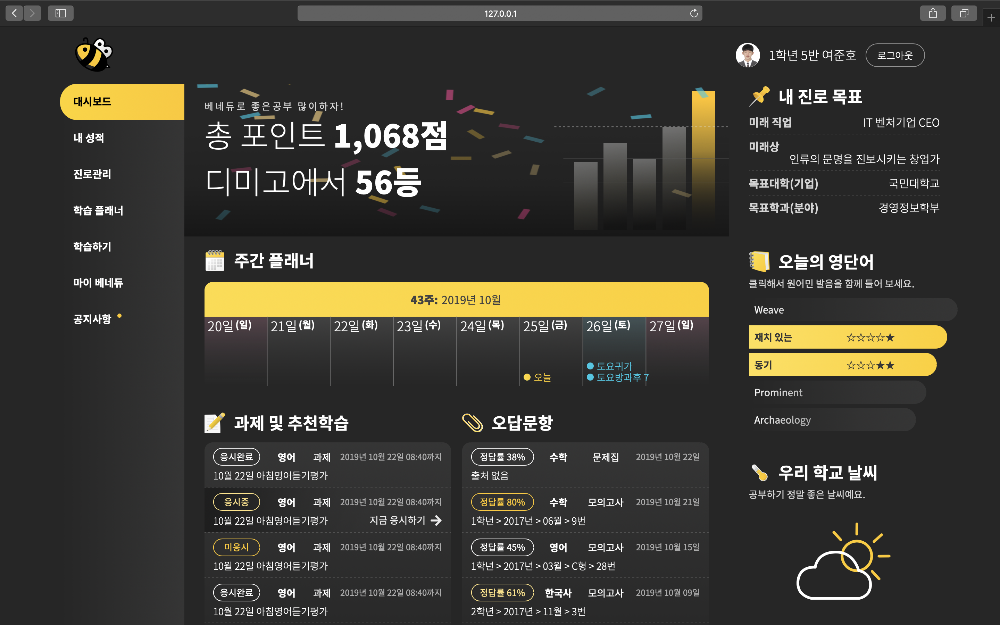
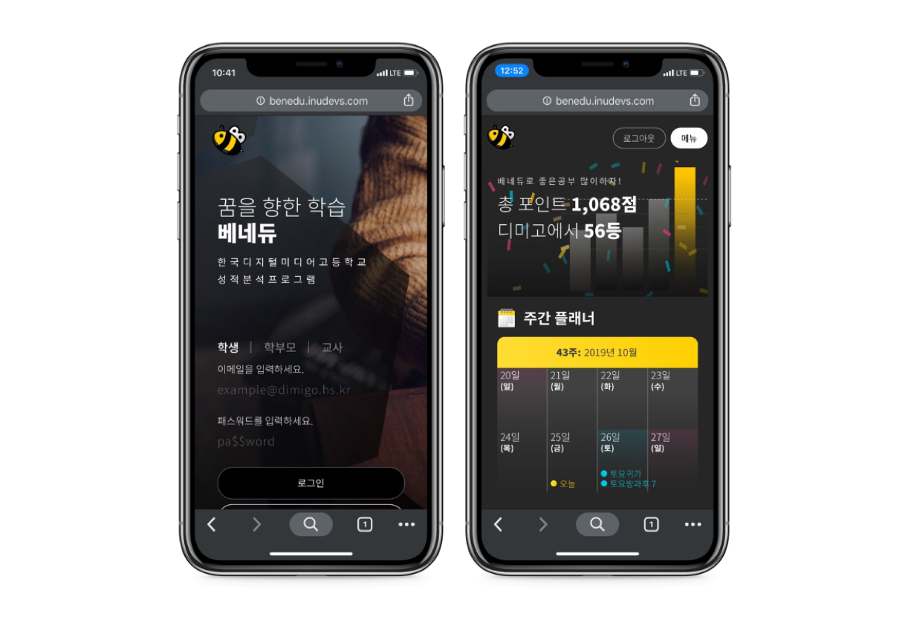

# 2019 베네듀 시안 공모전
한국디지털미디어고등학교 성적분석프로그램인 [베네듀](https://benedu.co.kr)를 리디자인하고 프론트엔드를 구현해 제출하는, **2019 베네듀 디자인 시안 공모전**에 참가한 작품입니다. [데모 페이지](http://benedu.inudevs.com)

> 랜딩 페이지

랜딩 페이지에는 외부인이 들어와도 베네듀가 무엇인지 알 수 있도록 간단한 소개와 사명을 넣었습니다. 또한, [학교 공식 홈페이지](https://dimigo.hs.kr)와 교내 인트라넷 [디미고인](https://dimigo.in), [디미고 라이프](https://dimigo.in)로의 링크를 달아 빠르게 이동할 수 있게 했습니다.

> 메인 페이지

시험기간에 친구들이 베네듀로 하루 종일 공부하다 보니, 밝은 화면 탓에 눈이 아프다고 하소연한 것이 생각나 다크 테마로 디자인했습니다. 시간 관계상 라이트/다크 모드로 전환하는 것은 구현하지 못했습니다.

그라데이션과 애니메이션, 이모지를 참조해 직접 테마 색에 맞게 그린 일러스트를 활용해 통일감 있고 고급스러운 느낌을 줍니다.

또한, 웹 표준의 [Web Speech API](https://wicg.github.io/speech-api/)를 사용해 영단어를 미국 발음으로 읽어주는 것을 구현했습니다.

  

> 모바일 뷰

모든 페이지는 반응형으로 만들어졌습니다. 개인적으로 사이드메뉴 쪽 구현이 약간 아쉽긴 합니다.
